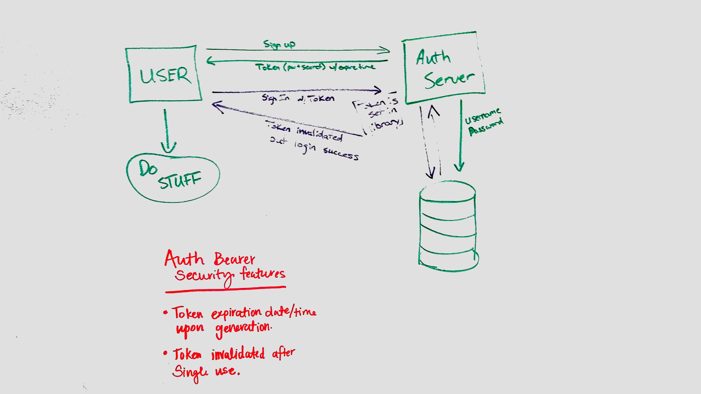

 LAB
=================================================

## Authorization 

### Author: Heather Cherewaty
### Collaborated with:  Brent Woodward, Siobhan Niess, Jacob Anderson, Becca Lee, & Caity Heath

### Links and Resources

* [repo](https://github.com/hcherewaty/18-authorization)
* [travis](https://www.travis-ci.com/hcherewaty/18-authorization)
* [Heroku] (https://hc-authorization.herokuapp.com/ )

#### Documentation
* [swagger](http://xyz.com) (API assignments only)
* [jsdoc](http://xyz.com) (All assignments)

### Modules
#### `index.js`

### Setup
#### `.env` requirements
* `PORT` - Defined in ENV.
* `MONGODB_URI` - Defined in ENV.

#### Running the app
* `npm start`
* Endpoint: `/f
  * Returns a user authentication tokens upon signup and signin
  
#### Tests
* npm test (runs unit tests)
* npm run lint (runs linter tests)
* `/signup` signs up a new user and stores in mongodb; also returns a token
* `/sigin` signs in an exisiting user with a unique token that expires within 60 seconds and can only be used once.

#### UML

